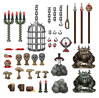
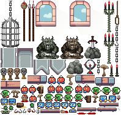

spright
=======
<p>
<a href="https://github.com/houmain/spright/actions/workflows/build.yml">
</a>
<a href="https://github.com/houmain/spright/issues">
</a>

<a href="https://github.com/houmain/spright/releases/latest">Downloads</a> |
<a href="#command-line-arguments">Command line arguments</a> |
<a href="#building">Building</a> |
<a href="https://github.com/houmain/spright/blob/main/CHANGELOG.md">Changelog</a>
</p>

__spright__ is more than a simple sprite sheet packer, it can be [used as one](#simple-sheet-packing) though. Its key ideas are:

- Keep all the information about the sprites and tiles, required for being efficiently consumable by the game engine, in a plain text file.
- Instead of forcing one to split each sprite in a separate file and later address them using the filename, it should be possible to keep them in whatever format they are most conveniently to handle.
- It should be possible to give each sprite an ID, group them (e.g. for animations) or further annotate them for game specific purposes.
- The tool should be able to deduce obvious information from the input images and assist with completing the required information.

No graphical user interface is required, a text editor is enough. A program like [GIMP](https://www.gimp.org), which can [overlay a grid](https://docs.gimp.org/2.10/en/gimp-concepts-image-grid-and-guides.html) over the input sheets one wants to annotate, may be useful though.

__Introduction:__
* [Simple sheet packing](#simple-sheet-packing)
* [Advanced usage example](#advanced-usage-example)

__Reference:__
* [Input definition scopes](#input-definition-scopes)
* [Input definition reference](#input-definition-reference)
* [Output description](#output-description)
* [Output template engine](#output-template-engine)

---

Command line arguments
----------------------
```
Usage: spright [-options]
  -i, --input <file>     input definition file (default: spright.conf).
  -o, --output <file>    output description file (default: spright.json).
  -t, --template <file>  template for output description.
  -p, --path <path>      path to prepend to all output files.
  -a, --autocomplete     autocomplete input sheet definition.
  -d, --debug            draw sprite boundaries and pivot points on output.
  -h, --help             print this help.
  -- <args>              interpret remaining arguments as a comma separated
                         list of input definitions.
```
The special identifiers _stdin_ and _stdout_ can be passed to _input_ and _output_ to enable console redirection.

Simple sheet packing
--------------------
To pack your sprites into one or more sheets, a simple input definition like the following example is enough:
```perl
colorkey

output "sheet{0-}.png"
  max-width 1024
  max-height 1024
  power-of-two true

input "characters/**/*.png"
input "scenery/**/*.png"
```
Unless specified on the [command line](#command-line-arguments) spright reads the input definition from ```spright.conf``` in the current directory. To pack the sheets and generate an output description consumable by e.g. [Phaser](https://github.com/photonstorm/phaser) using the [phaser.template](templates/phaser.template), call:
```
spright -t phaser.template
```
See the [input definition](#input-definition-reference) section for a description of the available options. \
See the [output template engine](#output-template-engine) section on how to generate a file consumable by your game engine.

Advanced usage example
----------------------
Say you got some nice sprites you would like to use in your next game:

| "Decorations (32x32).png" | "Old enemies 2.png" | "misc_scenery.png" | "OrcAttack/Frame01.png" to <br/> "OrcAttack/Frame04.png" |
|:---:|:---:|:---:|:---:|
| <kbd></kbd> |  | <kbd></kbd> | <kbd></kbd> <kbd></kbd> <kbd></kbd> <kbd></kbd>

And your game engine supports efficiently packed sprite sheets like this:

<kbd></kbd>

Then you may want to use spright to define the sprites within their original sources and directly pack the sheet from there.

To do so, start by creating a ```spright.conf``` containing the essential information:
```perl
colorkey
padding 1

input "Decorations (32x32).png"
  grid 32 32

input "Old enemies 2.png"
  grid 16 16

input "Orc Attack/Frame{01-04}.png"

input "misc_scenery.png"
  atlas
```
When spright is called without [command line](#command-line-arguments) arguments, the [input definition](#input-definition-reference) is read from ```spright.conf``` and it writes a ```spright0.png``` containing the packed sprites and a ```spright.json``` file containing the [output description](#output-description).

Passing the argument **-a** or **--autocomplete** activates the auto-completion, which extends ```spright.conf``` with automatically deduced information:

```perl
input "Decorations (32x32).png"
  grid 32 32
    sprite
    sprite
    sprite
    sprite
    sprite
  row 1
    sprite
    sprite
    sprite
    sprite
    sprite
...
```
It detected that ```Decorations (32x32).png``` contains five sprites per row and added them below...\
For sheets without grids it adds the sprites' rectangles:
```perl
...
input "misc_scenery.png"
  atlas
  sprite
    rect 78 12 6 27
  sprite
    rect 88 12 4 24
  sprite
    rect 97 9 6 34
  sprite
    rect 107 8 7 40
  sprite
    rect 6 17 17 52
...
```
Now you can complete the definition manually by e.g. giving the sprites IDs and customizing their pivot points:
```perl
colorkey
padding 1

input "Decorations (32x32).png"
  grid 32 32
  pivot left top
    sprite "banner_top"
    sprite "platform_1_left"
    sprite "platform_1_middle"
    sprite "platform_1_right"
    sprite "platform_1_sole"
  row 2
    sprite "banner_middle"
    sprite "platform_2_left"
    sprite "platform_2_middle"
    sprite "platform_2_right"
    sprite "platform_2_sole"
  row 3
    sprite "banner_bottom_1"
...
```
Auto-completion can be executed anytime, but it currently only touches _inputs_ without any defined _sprites_.\
You can also tag sprites to define animations or other game specific properties and leave sprites you do not want to directly address without ID:
```perl
...
input "Old enemies 2.png"
  grid 16 16
    tag anim "blue_enemy_idle"
    sprite
    sprite
    tag anim "blue_enemy_dead"
    sprite
    tag anim "blue_enemy_jump"
    sprite
  row 1
    tag anim "blue_enemy_run"
    sprite
    sprite
    sprite
    sprite
    sprite
    sprite
  row 2
...
```
The [following section](#input-definition-scopes) clarifies the effect of hierarchies.\
See the [output template engine](#output-template-engine) section on how to generate a file consumable by your game engine.

Input definition scopes
-----------------------
Indentation is relevant in the hierarchical input definition file. There are two scoping rules:
1. A definition affects succeeding subjects on the same or a sub-level.
2. A definition affects its parent subject.

The comments in the following sample should exemplify these:
```perl
pivot center middle      # sets default pivot point

input "furniture.png"
  pivot center bottom    # sets pivot point within "furniture.png"
  sprite "chair"
  sprite "lamp"
    pivot center top     # sets pivot point of "lamp"
  sprite "bed"

input "characters.png"
  sprite "player"
  sprite "bird"
    pivot center bottom  # sets pivot point of "bird"
  sprite "wolf"          # "wolf" still gets the default pivot point
```

Input definition reference
--------------------------
The following table contains a list of all definitions, with the subject each affects, the expected arguments and a description. Optional arguments are enclosed in square brackets. Unless specified otherwise, optional booleans default to _true_, numbers default to _1_, and an additional value defaults to the first value.

| Definition     |Subject| Arguments    | Description |
| -------------- |-------| -------------| ----------- |
| **output**     |sprite | path         | Sets the output texture's _path_. It can describe an un-/bounded sequence of files (e.g. "sheet{0-}.png").
| pack           |output | pack-method  | Sets the method, which is used for placing the sprites on the output textures:<br/>- _binpack_ : Tries to reduce the texture size, while keeping the sprites' (trimmed) rectangles apart (default).<br/>- _compact_ : Tries to reduce the texture size, while keeping the sprites' convex outlines apart.<br/>- _single_ : Put each sprite on its own texture.<br/>
| width          |output | width        | Sets a fixed output texture width.
| height         |output | height       | Sets a fixed output texture height.
| max-width      |output | width        | Sets a maximum output texture width.
| max-height     |output | height       | Sets a maximum output texture height.
| power-of-two   |output | [boolean]    | Restricts the output texture's size to be a power of two.
| square         |output | [boolean]    | Restricts the output texture's size to be square.
| align-width    |output | pixels       | Restricts the output texture's width to be divisible by a certain number of _pixels_.
| allow-rotate   |output | [boolean]    | Allows to rotate sprites clockwise by 90 degrees for improved packing performance.
| padding        |output | [pixels], [pixels] | Sets the space between two sprites / the space between a sprite and the texture's border.
| duplicates     |output | dedupe-mode  | Sets how identical sprites should be processed:<br/>- _keep_ : Disable duplicate detection (default).<br/>- _share_ : Identical sprites should share pixels on the output texture.<br/>- _drop_ : Duplicates should be dropped.
| alpha          |output | alpha-mode<br/>[color] | Sets an operation depending on the pixels' alpha values:<br/>- _keep_ : Keep source color and alpha.<br/>- _clear_ : Set color of fully transparent pixels to black.<br/>- _bleed_ : Set color of fully transparent pixels to their nearest non-fully transparent pixel's color.<br/>- _premultiply_ : Premultiply colors with alpha values.<br/>- _colorkey_ : Replace fully transparent pixels with the specified _color_ and make all others opaque.
| layers         |output/input|suffixes+| Specifies the number of layers and their filename suffixes (e.g. "-diffuse", "-normals", ...). Only the first layer is considered when packing, others get identical _rects_.
| **input**      |-      | path         | Adds a new input file at _path_. It can contain wildcards (e.g. "sprites/**/*.png") or it can describe an un-/bounded sequence of files (e.g. "frames_{0-}.png, frames_{0001-0013}.png").
| path           |input  | path         | A _path_ which should be prepended to the input's path.
| colorkey       |input  | [color]      | Specifies that the input has a color, which should be considered transparent (in hex notation e.g. _FF00FF_).
| grid           |input  | x, [y]       | Specifies that the input contains multiple sprites, arranged in a grid of a certain cell size. In this mode the _rect_ of each _sprite_ is deduced from the grid. Each _sprite_ automatically advances the current cell horizontally.
| grid-cells     |input  | x, y         | As _grid_, but specifies the number of cells instead of their size. When the cells are squares, one dimension is allowed to be _0_, so it is automatically deduced.
| grid-offset    |input  | x, [y]       | Offsets the grid from the top-left corner by a number of pixels.
| grid-spacing   |input  | x, [y]       | Sets a spacing between the grid cells.
| row            |input  | row          | Sets a sprite's vertical offset within a grid (starting with 0).
| skip           |input  | [columns]    | Skips one or more horizontal grid cells.
| atlas          |input  | [pixels]     | Specifies that the input contains multiple unaligned sprites, separated by more than a specific number of transparent pixel rows.
| **sprite**     |input  | [id]         | Adds a new sprite to an input sheet (_id_ defaults to an empty string).
| id             |sprite | id           | Sets the sprite's id. Can contain the placeholder _%i_, which is replaced by the sprite index.
| span           |sprite | columns, rows| Sets the number of grid cells a sprite spans.
| rect           |sprite | x, y, width, height | Sets a sprite's rectangle in the input sheet.
| pivot          |sprite | pivot-x, pivot-y | Sets the coordinates of the sprite's pivot point. Optionally the horizontal (_left, center, right_) and vertical (_top, middle, bottom_) origin of the coordinates can be set (e.g. 10 20, right - 5 top + 3, bottom left).
| tag            |sprite | key, [value] | Adds a tag to a sprite (_value_ defaults to an empty string).
| trim           |sprite | trim-mode    | Sets a mode for trimming, which reduces the sprite to the non-transparent region:<br/>- _none_ : Do not trim.<br/>- _rect_ : Trim to rectangular region (default).<br/>- _convex_ : Trim to convex region (_vertices_ are set in output description).
| trim-channel   |sprite | channel      | Sets the channel which should be considered during trimming:<br/>- _alpha_ : The alpha channel of a pixel (default).<br/>- _gray_ : The gray level of the pixel.
| trim-threshold |sprite | value        | Sets the value which should be considered non-transparent during trimming (1 - 255).
| trim-margin    |sprite | [pixels]     | Sets a number of transparent pixel rows around the sprite, which should not be removed by trimming.
| crop           |sprite | [boolean]    | Sets whether the sprite's rectangle should be reduced to the trimmed bounds.
| extrude        |sprite | [pixels]     | Adds a padding around the sprite and fills it with the sprite's border pixel color.
| common-divisor |sprite | x, [y]       | Restricts the sprite's size to be divisible by a certain number of pixels. Smaller sprites are filled up with transparency.
| group          |-      | -            | Can be used for opening a new scope, to limit for example the effect of a tag.

Output description
------------------
By default a [JSON](https://www.json.org) file containing all the information about the sprites is written to ```spright.json```. It has the following structure:
```json
{
  "sprites": [
    {
      "index": 0,
      "id": "sprite_0",
      "pivot": { "x": 8, "y": 8 },
      "rect": { "x": 0, "y": 0, "w": 16, "h": 16 },
      "rotated": false,
      "sourceFilename": "source.png",
      "sourcePath": "path",
      "sourceRect":  { "x": 0, "y": 0, "w": 16, "h": 16 },
      "trimmedRect": { "x": 0, "y": 0, "w": 16, "h": 16 },
      "trimmedSourceRect": { "x": 0, "y": 0, "w": 16, "h": 16 },
      "textureFilename": "path/spright0.png",
      "textureSpriteIndex": 0,
      "vertices": [ { "x": 0, "y": 0 } ],
      "tags": { "key": "value" }
    }
  ],
  "tags": [
    {
      "key": "key",
      "value": "value",
      "spriteIndices": [ 0 ]
    }
  ],
  "textures": [
    {
      "filename": "path/spright0.png",
      "width": 256,
      "height": 256,
      "spriteIndices": [ 0 ]
    }
  ]
}

```
For example, [spright.json](docs/spright.json) was generated from the [sample](#advanced-usage-example) above. As you can see, it is very verbose and only intended as an intermediate file, which should be transformed using the [template engine](#output-template-engine).

Output template engine
----------------------
With the power of the [inja](https://github.com/pantor/inja/) template engine it should be possible to transform the [output description](#output-description) to a text file consumable by your game engine.\
A template is selected with the **-t** or **--template** and the output filename with the **-o** or **--output** parameter:

```
spright -t cpp.template -o spright.h
```
This is what a simple template, that transforms the IDs of the output description's sprites into a JavaScript array initialization, looks like:
```php
let sprite_ids = [

"{{ sprite.id }}",

];
```
For information about the functionality of the template engine, please see the [inja reference](https://pantor.github.io/inja/) and the provided templates:

Target  | Template
--------|--------
C++     | [cpp.template](templates/cpp.template)
[Phaser 3](https://github.com/photonstorm/phaser) | [phaser.template](templates/phaser.template)
[Phaser 2](https://github.com/photonstorm/phaser) | [phaser2.template](templates/phaser2.template)

The C++ template is just an example for how the sprite description can be directly embedded in code. This [spright.h](docs/spright.h) was generated from the [sample](#advanced-usage-example), using the [cpp.template](templates/cpp.template) template.

---

Building
--------

A C++17 conforming compiler is required. A script for the
[CMake](https://cmake.org) build system is provided.

**Installing dependencies on Debian Linux and derivatives:**
```
sudo apt install build-essential git cmake
```

**Checking out the source:**
```
git clone --recurse-submodules https://github.com/houmain/spright
```

**Building:**
```
cd spright
cmake -B build
cmake --build build
```

License
-------

It is released under the GNU GPLv3. It comes with absolutely no warranty. Please see `LICENSE` for license details.
